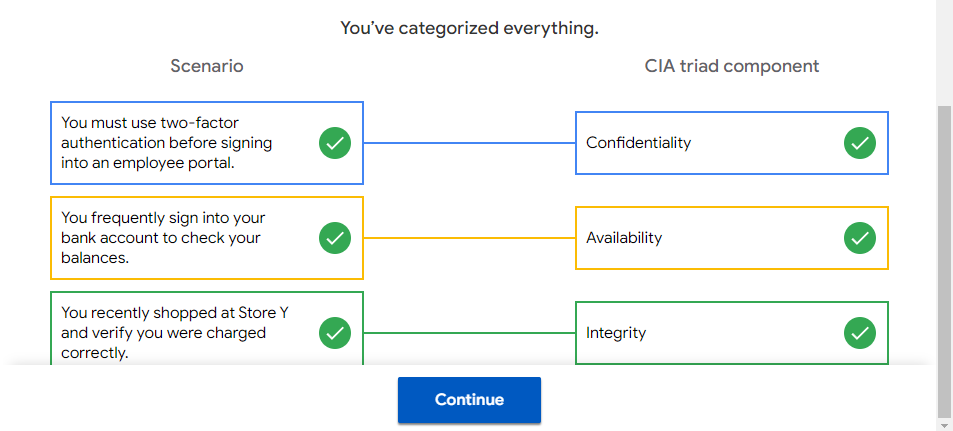

### Security frameworks 
are guidelines used for building plans to help mitigate risk and threats to data and privacy. Frameworks support organizations’ ability to adhere to compliance laws and regulations. For example, the healthcare industry uses frameworks to comply with the United States’ Health Insurance Portability and Accountability Act (HIPAA), which requires that medical professionals keep patient information safe. 

### Security controls 
are safeguards designed to reduce specific security risks. Security controls are the measures organizations use to lower risk and threats to data and privacy. For example, a control that can be used alongside frameworks to ensure a hospital remains compliant with HIPAA is requiring that patients use multi-factor authentication (MFA) to access their medical records. Using a measure like MFA to validate someone’s identity is one way to help mitigate potential risks and threats to private data.

# CIA (confidentiality, integrity, and availability)
## Confidentiality 
means that only authorized users can access specific assets or data.
## Integrity 
means that the data is correct, authentic, and reliable.
## Availability 
means that the data is accessible to those who are authorized to access it.

